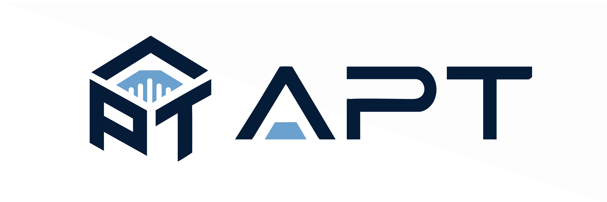
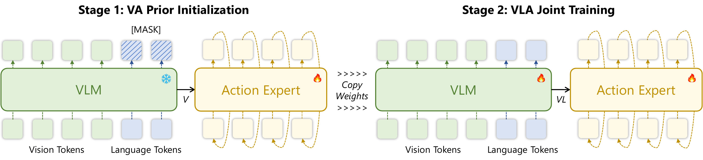

<p align="center">
  
</p>

<div align="center">
<h2 style="border-bottom: none; margin-bottom: 0px ">APT: Action Expert Pretraining<br>Improves Instruction Generalization of Vision-Language-Action Policies</h2>

[Kechun Xu](https://xukechun.github.io/) · [Zhenjie Zhu]() · [Anzhe Chen]() · [Rong Xiong](https://scholar.google.com/citations?user=1hI9bqUAAAAJ&hl=en) · [Yue Wang](https://ywang-zju.github.io/)

<a href="assets/paper.pdf"></a>
<a href='https://xukechun.github.io/papers/APT'></a>

</div>

**TL; DR**: APT factorizes the VLA policy into a Vision-Action (VA) prior and a language-conditioned VLA likelihood, and pretrains the action expert as the VA prior on vision-action pairs from a frozen VLM. A layer-wise gated fusion mechanism then injects language tokens into the pretrained action expert, preserving the visuomotor prior while enabling instruction following. APT delivers consistent gains on OOD language instructions and compositional tasks.

## 🏆 Highlights

🔍 **Key Findings**: continuous-action VLA policies start from a randomly initialized action expert and learn from imbalanced VLA data, producing noisy gradients that corrupt the VLM backbone and collapse to visual shortcuts.

✨ **Key Insights**:
- **Bayesian factorization** of the VLA policy:

$$
\pi(\mathbf{a}\mid\mathbf{v},\ell)\ \propto\ \pi^{p}(\mathbf{a}\mid\mathbf{v})\cdot L(\ell\mid\mathbf{v},\mathbf{a})
$$

  - **VA prior** $\pi^p(\mathbf{a}\mid\mathbf{v})$ is trained on **balanced** vision-action pairs alone, so the action expert builds coherent visuomotor priors without any language shortcut.
  - **VLA likelihood** $L(\ell\mid\mathbf{v},\mathbf{a})$ then aligns the prior to language instructions, a much easier sub-problem than learning action generation and language grounding jointly.

- **Layer-wise gated fusion** injects each Qwen3-VL intermediate feature into the corresponding action-expert self-attention layer through a learnable sigmoid gate, letting the action expert inherit VLM semantics without overwriting the pretrained visuomotor pathway.

- **Two-stage realization** inside one network. Stage 1 activates only half of the action-expert attention layers and masks language tokens, training a pure VA prior. Stage 2 inserts an interleaved attention layer after each Stage-1 layer, unmasks language, and jointly trains the prior and likelihood under large-scale data.

- **Architecture-agnostic**: the two-stage recipe also boosts $\pi$-style and GR00T-style architectures on OOD language generalization.

## 🧩 Overview

Given VLA datasets with modality imbalance, APT trains the policy in two stages:

- **Stage 1 - VA Prior Pretraining**: the action expert is conditioned solely on visual tokens from a frozen Qwen3-VL backbone and learns $\pi^p(\mathbf{a}\mid\mathbf{v})$.
- **Stage 2 - VLA Likelihood Alignment**: the Stage-1 layers are duplicated with interleaved language-injection layers; the full policy is jointly trained on the same data.

<p align="center">
  
</p>

## 📁 Project Structure

```
APT/
├── apt/                       # core model + unified trainer (this is the package)
│   ├── vla.py                 # VLA wrapper (VLM + ActionExpert)
│   ├── vlm.py                 # Qwen3-VL encoder bridge
│   ├── action_expert.py       # diffusion-based action expert with gated fusion
│   ├── action_transform.py    # SE(3) ↔ 10-dim action conversions
│   ├── configs.py             # TrainConfig + CONFIGS registry
│   ├── train.py               # unified DDP + DeepSpeed trainer
│   ├── ds_config_zero2.json   # DeepSpeed ZeRO-2 config
│   ├── ds_config_zero3.json   # DeepSpeed ZeRO-3 config
│   ├── encoders/              # Qwen3-VL (LoRA-capable) wrapper
│   ├── layers/                # attention / RoPE / norms / 6D-rotation utils
│   └── infer/                 # planner + remote inference service
├── data_utils/                # HDF5 IO, datasets, video decoding, distributed samplers
├── train_utils/               # EMA implementation
├── infer_utils/               # trajectory ensembler and visualizer
├── shm_transport/             # Pyro4 + shared-memory RPC for remote inference
├── scripts/
│   ├── train.sh               # two-stage pretraining (DDP or DeepSpeed)
│   └── finetune.sh            # task-specific fine-tuning (DDP or DeepSpeed)
├── assets/                    # logo / method (PDF source + PNG for README), paper.pdf
├── requirements.txt
├── .gitignore
└── README.md
```

## 📘 Usage

### Environment

```bash
conda create -n apt python=3.10 -y
conda activate apt
# Install a PyTorch build that matches your CUDA. The pinned xformers requires
# torch 2.4.1; relax it if you use a different torch version.
pip install torch==2.4.1 torchvision==0.19.1 --index-url https://download.pytorch.org/whl/cu121
pip install -r requirements.txt
```

> **Note on `xformers` / `deepspeed`**: both are version-sensitive. If you do not need DeepSpeed, you can skip installing it - `--backend ddp` works without it. Likewise drop `xformers` if you do not need its kernels.

### Data Preparation

APT consumes trajectories stored as per-episode HDF5 files. Each sample yielded by the dataloader looks like:

```python
{
    "obs_rgbs":             (To, ncam, 3, H, W),  # observation frames
    "prompt_text":          str,                  # task description
    "current_ee_pose":      (nee, 4, 4),          # current EE pose in world frame
    "gt_future_ee_states":  (Ta, nee, 17),        # ground truth pose + gripper
    "history_ee_states":    (Th, nee, 17),
    "obs_norm_xys":         (...),                # per-pixel normalized 2D coords
    "obs_extrinsics":       (To, ncam, 4, 4),
    "valid_ee_mask":        (nee,),
    ...                                           # see data_utils/dataset_base.py
}
```

**Adding a new dataset:**
1. Subclass `H5DatasetMapBase` in `data_utils/datasets.py`.
2. Register the dataset entry in `data_utils/data_loc.py`. The file looks up the host IP (`get_ipv4_address`) and selects the matching dictionary - **edit it to point at your local paths** before launching training.
3. Reference the new class from a `TrainConfig` entry in `apt/configs.py`.

We expose a number of preset configs (see `apt/configs.py` for the full list). Examples:

| Config                          | Purpose                                                    |
|---------------------------------|------------------------------------------------------------|
| `pretrain`                      | Pretrain on Droid + AgiBotWorld + RoboTwin + InternM1      |
| `pretrain_final`                | Larger pretraining mix (adds InternA1 splits + EgoDex)     |
| `finetune_libero`               | Fine-tune on all four LIBERO suites jointly                |
| `finetune_libero_spatial_plus`  | Fine-tune on the LIBERO-PRO Spatial split                  |
| `finetune_aloha_pp_storage`     | Real-world ALOHA pick-place + table-storage fine-tuning    |
| `debug`                         | Tiny single-batch config used for smoke tests              |

### Two-stage Pretraining

`scripts/train.sh` drives both stages and accepts either back-end. Common arguments:

| Flag                | Meaning                                                 |
|---------------------|---------------------------------------------------------|
| `--backend`         | `ddp` (torchrun) or `deepspeed`                         |
| `--gpus`            | Comma-separated GPU IDs, e.g. `0,1,2,3`                 |
| `--stage`           | `0` (VA only), `1` (VLA only), or `both`                |
| `--config`          | Config name from `apt/configs.py`                       |
| `--va-name`         | Save name for the Stage-0 checkpoint                    |
| `--vla-name`        | Save name for the Stage-1 checkpoint                    |
| `--va-conti`        | Resume Stage-0 from an existing checkpoint              |
| `--vla-conti`       | Resume Stage-1 from an existing checkpoint              |
| `--bs / --max-iter` | Per-GPU batch size / max iterations                     |

DeepSpeed-only flags (ignored when `--backend ddp`):

| Flag             | Meaning                                            |
|------------------|----------------------------------------------------|
| `--ds-zero 2\|3` | ZeRO stage (selects `ds_config_zero{2,3}.json`)    |
| `--accum N`      | Gradient accumulation steps                        |
| `--vlm-mode`     | `frozen` / `lora` / `full` VLM finetune mode       |
| `--vlm-lr`       | Separate learning rate for VLM parameters          |
| `--gc`           | Enable gradient checkpointing                      |

**DDP (torchrun) example - both stages back-to-back:**
```bash
bash scripts/train.sh --backend ddp --gpus 0,1,2,3 \
    --config pretrain \
    --va-name apt_va --vla-name apt_vla
```

**DeepSpeed ZeRO-3 + LoRA VLM, Stage-1 only:**
```bash
bash scripts/train.sh --backend deepspeed --gpus 0,1,2,3 --stage 1 \
    --config pretrain \
    --va-name apt_va --vla-name apt_vla_lora \
    --ds-zero 3 --vlm-mode lora --gc --vlm-lr 5e-6
```

**Resume Stage-1 after preemption:**
```bash
bash scripts/train.sh --backend ddp --gpus 0,1,2,3 --stage 1 \
    --config pretrain --vla-conti apt_vla
```

Stage-1 internally calls `VLA.load_from_pretrain(..., load_from_va=True)`, which doubles the Stage-1 attention layers and copies the Stage-0 weights into the odd indices while leaving the inserted (even-index) language-injection layers randomly initialized.

### Task-specific Fine-tuning

`scripts/finetune.sh` mirrors `train.sh` but additionally exposes `--pretrained-ckpt` so you can bootstrap from any pretraining checkpoint. The Stage-1 launch automatically reuses the Stage-0 name (if any) or the pretraining checkpoint as the upstream.

```bash
# Both stages on LIBERO from a pretrained VLA checkpoint
bash scripts/finetune.sh --backend ddp --gpus 0,1,2,3 \
    --config finetune_libero --pretrained-ckpt apt_vla \
    --va-name ft_va --vla-name ft_vla

# Stage-1 only, DeepSpeed ZeRO-3 + LoRA on real ALOHA data
bash scripts/finetune.sh --backend deepspeed --gpus 0,1,2,3 --stage 1 \
    --config finetune_aloha_pp_storage --pretrained-ckpt apt_vla \
    --vla-name ft_aloha_lora \
    --ds-zero 3 --vlm-mode lora --gc --accum 4 --bs 8 --vlm-lr 5e-6
```

Checkpoints are written under `./checkpoints/APT/<name>/` and TensorBoard logs under `./logs/APT/<name>/`. Both roots are configurable per run via the optional flags `--ckpt_dir /path/to/ckpts` and `--log_dir /path/to/logs`, e.g. to keep separate experiments on different volumes. Likewise `--dataloader_timeout <seconds>` (default 300) lets you raise the DataLoader worker timeout for slow shared storage.

### Loading existing BayesVLA / APT checkpoints

The merged trainer is backwards-compatible with checkpoints produced by the pre-refactor training scripts. A checkpoint is recognised by its file layout:

| Saved by                | Top-level keys in `ckpt_latest.pt`                                          |
|-------------------------|------------------------------------------------------------------------------|
| DDP (`train_dist.py`)   | `weights`, `optimizer`, `scheduler`, `scaler`, `current_iters`, ...          |
| DeepSpeed (`train_deepspeed.py`) | `weights`, `vlm_weights` (if VLM fine-tuned), no embedded optimizer |

The merged `apt.train` accepts both, and you can also switch back-ends across resumes (e.g. resume a DeepSpeed-trained run under DDP). When a checkpoint's optimizer state cannot be re-loaded (e.g. param groups differ because `--vlm-mode` changed), the trainer logs a warning and continues with a fresh optimizer.

**Pre-flight check** - validate any existing checkpoint before launching training:

```bash
# Stage-0 VA checkpoint
python scripts/test_ckpt.py \
    --ckpt /path/to/m0113_vaprior_..._all/ckpt_latest.pt --train-stage 0

# Same VA checkpoint used to bootstrap Stage-1
python scripts/test_ckpt.py \
    --ckpt /path/to/m0113_vaprior_..._all/ckpt_latest.pt --train-stage 1 --load-from-va

# Stage-1 VLA checkpoint (already-trained policy)
python scripts/test_ckpt.py \
    --ckpt /path/to/m0113_vlaprior_..._vlmft/ckpt_latest.pt --train-stage 1
```

**Bootstrap a new fine-tuning run from an existing VLA checkpoint (most common):**

```bash
bash scripts/finetune.sh --backend deepspeed --gpus 0,1,2,3 --stage 1 \
    --config finetune_libero \
    --pretrained-ckpt /path/to/m0113_vlaprior_..._vlmft/ckpt_latest.pt \
    --vla-name ft_libero --vlm-mode full
```

`--pretrained-ckpt` accepts either a checkpoint subdir name under `./checkpoints/APT/` **or** an absolute path ending in `.pt`. The trainer starts with `current_iters=0` so the new run gets a clean iteration counter, and saves under `./checkpoints/APT/<vla-name>/`.

**Resume training from an existing absolute-path checkpoint:**

```bash
# Resume a stage-1 run under a new local save directory (derived from the
# parent folder name of the source ckpt, so the source is never overwritten).
bash scripts/train.sh --backend deepspeed --gpus 0,1,2,3 --stage 1 \
    --vla-conti /path/to/m0113_vlaprior_..._vlmft/ckpt_latest.pt
```

### Direct Python Invocation

`scripts/train.sh` is a thin wrapper around `apt.train`. You can launch the trainer directly:

```bash
# DDP
CUDA_VISIBLE_DEVICES=0,1 torchrun --nproc_per_node 2 \
    -m apt.train --backend ddp \
    --config pretrain -s my_va_exp --train_stage 0

# DeepSpeed
deepspeed --include localhost:0,1 \
    --module apt.train --backend deepspeed \
    --ds-config ds_config_zero2.json \
    --config pretrain -s my_va_exp --train_stage 0
```

### Inference

For local inference, instantiate the planner directly:

```python
from apt.infer.planner import TrajPlanner

planner = TrajPlanner(
    ckpt_path="checkpoints/APT/ft_vla/ckpt_latest.pt",
    device="cuda:0",
    ensemble=4,
    use_ema=False,
)
planner.set_prompt("Pick up the grape and place it on the pink box.")
planner.add_obs_frame(obs_frame)
actions = planner.get_action()
```

To serve the policy as a remote service (e.g. for hardware control), first launch a Pyro4 naming server, then start the service:

```bash
# 1. Naming server (defaults to localhost:9091)
pyro4-ns -p 9091

# 2. Inference service
python -m apt.infer.remote_service \
    --ckpt checkpoints/APT/ft_vla/ckpt_latest.pt \
    --uri apt_control \
    --host localhost --port 0 \
    --ensemble 4
```

The client side uses `shm_transport` (zero-copy shared memory + Pyro4) to call `add_obs_frame`, `set_prompt`, `get_action`, etc.

## 🤝 Acknowledgements

This project builds upon [BayesVLA](https://github.com/xukechun/BayesVLA), and [E2VLA](https://github.com/hhcaz/e2vla). We thank these teams for their open-source contributions.

## 📚 Citation

If you find this work useful, please consider citing:

```
@article{xu2025apt,
      title={APT: Action Expert Pretraining Improves Instruction Generalization of Vision-Language-Action Policies},
      author={Xu, Kechun and Zhu, Zhenjie and Chen, Anzhe and Xiong, Rong and Wang, Yue},
      year={2025}
    }
```
